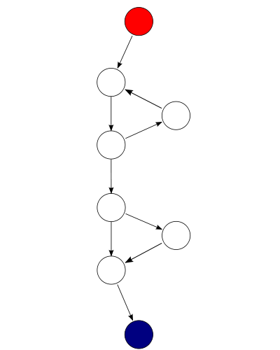
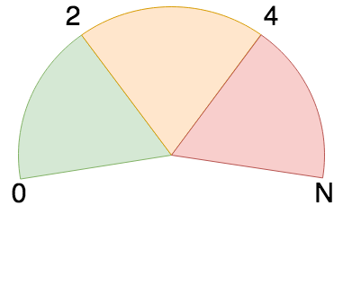
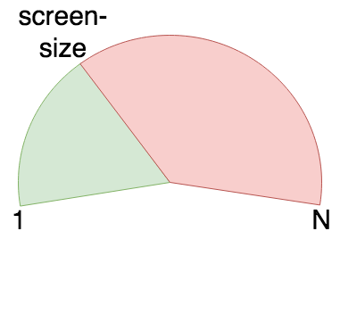

# Code metrics

Code quality metrics and standards in general can have a serious indirect influence on how secure specific code is. Code quality can be divided into several subjects which influence the ease with which code can be maintained.

* [Top 15 best practices for readable code](https://code.tutsplus.com/tutorials/top-15-best-practices-for-writing-super-readable-code--net-8118)
* [Code C.R.A.P.](https://www.artima.com/weblogs/viewpost.jsp?thread=215899): Change Risk Analysis and Predictions / Change Risk Anti-Patterns
  * [CRAP 4 Java](http://www.crap4j.org/)

## Code quality

Here are the five basic code quality metrics: 

### Maintainability

Maintainability measures the ease with which code can be changed, bugs can be fixed and extended. 

#### .NET

Using Visual Studio, the maintainability score can be calculated. This produces an integer value of 0 to 100, whereby larger values indicate a higher (better) maintainability. Microsoft advises to keep the score above 20, though I'ld advise to also look at code that scores between 20-50. The index is an aggregated score of several indexes, including cyclomatic complexity, lines of code and the Halstead volume. 


* Maintainability index: See Visual Studio support
  * 0-24: Low
  * 25-74: Moderate
  * 75-100: Good

* [source](https://blogs.msdn.microsoft.com/zainnab/2011/05/26/code-metrics-maintainability-index/)


### Cyclomatic Complexity

This metric indicated the complexity of code and is best calculated per method. The index is calculated by defining the total number of independent branches or possible paths within a method. More paths means a higher index, which indicates higher complexity. The expressions and operands that increase the index are:
* ```if```
* Each ```case``` and ```default``` in a ```switch```
* ```for```, ```foreach``` and ```while```
* ```catch``` and ```throw``` or ```throws```
* ```&&```, ```&```, ```||```, ```|```, , ```^```, ```a ? b : c```, ```x ?? y```


Cyclomatic complexity can be calculated using the formula below. The formal definition of the cyclomatic complexity v(G) is based on the representation of a method's control flow graph as a directed graph, where

* E is the number of edges
* N the number of nodes
* P is the number of connected components 
```
v(G) = E - N + 2P
```
Since we will only review complexity of methods, which always connect all code from start to end, P will always be 1 and we can simplify the formula to:
```
v(G) = E - N + 2
```

This results in a value of 2 or higher. Keeping the index below 11 for scope of methods is best, though experienced teams could choose to set the threshold to 15 if done with care.



In this graph, we see 9 edges and 8 nodes. Therefore the complexity is ```9 - 8 + 2 = 3```

Cyclomatic complexity directly influences the minimum number of tests required to potentially cover all the code in unit-tests.


* 2-10: Good
* 11-20: Okay
* 21+: Avoid

Sources:
* [Wikipedia](https://en.wikipedia.org/wiki/Cyclomatic_complexity)

#### Java

JaCoCo calculates cyclomatic complexity of a method with the following equivalent formula where:
* B is the number of branches
* D is the number of decision points

```
v(G) = B - D + 1
```

Tools to calculate Cyclomatic complexity for your code:
* [SonarQube](https://docs.sonarqube.org/latest/user-guide/metric-definitions/)
* [JaCoCo](https://www.eclemma.org/jacoco/)
* [Eclipse Metrics plugin](https://github.com/qxo/eclipse-metrics-plugin)

#### .NET

Visual Studio contains the Code Metrics functionality to calculate Cyclomatic Complexity

* [MSDN Blog](https://blogs.msdn.microsoft.com/zainnab/2011/05/17/code-metrics-cyclomatic-complexity/)
* [C-Sharp corner](https://www.c-sharpcorner.com/article/code-metrics-cyclomatic-complexity/)

### Inheritence

The depth of inheritance metric indicates the depth of the inheritance chain, including classes and interfaces. Higher inheritence depth means a more complex object hierarchy. Lower values are better because it will be easier to follow the flow of the code when debugging or analyzing. 



Code Metrics Viewer rates the metric value the following way:
* 1-2 base types are good
* 3-4 base types are still okay
* everything above 4 is critical and should be reviewed and possibly refactored

[Source](https://codemetricsviewer.wordpress.com/2011/06/26/how-to-interpret-received-results/)

### Class coupling

Class coupling indicates how dependent a class is upon other classes. 

This metric can be used as an indicator of how evolvable a function, a class, or at least an assembly project actually is. 
It is calculated for each level and represents the number of types (excluding built-in language types) being used by a method, class, etc.. 
Lower values are better. 

Code Metrics Viewer rates this metric value the following way: 

* Per member (method) 


* Per type (class, interface, enum)

  
* [source](https://blogs.msdn.microsoft.com/zainnab/2011/05/25/code-metrics-class-coupling/)

### Lines of code

Lines of code is both a measurement of quality and readability. This will mean that there are two thresholds to adhere to. Always take the lower threshold.
For both criteria, the lines of code are measured in context of a single method. For the quality criteria, a method with more lines of code will often 
fulfil more than one purpose and will therefore be much harder to test. Keeping a method simple and focused will result in smaller methods.

Code Metrics Viewer rates this metric value the following way: 


## Additional metrics
* Number of methods per class:
  * Aim for max 20
* Number of fields per class:
  * Aim for max 20
* Number of Parameters per method: too many parameters are more complex.
* Number of Variables per method: Larger numbers is more difficult to maintain.
* Class Coupling: number of unique classes used in a class as parameters, local vars, return types etc
  * Low coupling (low number of references classes) is better
* Afferent coupling: Inbound coupling from types outside of the assembly
* Efferent Coupling: Outbound coupling, determined by the number of types outside an assembly that are used by child types of the assembly
* Relational Cohesion: Average number of internal relationships per type

# Reusability

TODO:
* [Measuring Code reusability](https://stackoverflow.com/questions/3184432/measuring-code-reusability)
* [Code Reuse is not a good goal](https://blog.ndepend.com/code-reuse-not-good-goal/)


# Readability

## Inline comments

* [Comments tell you why](https://blog.codinghorror.com/code-tells-you-how-comments-tell-you-why/)
* [Wikipedia](https://en.wikipedia.org/wiki/Comment_(computer_programming)
* [Coding standards for clarity](https://softwareengineering.stackexchange.com/questions/336430/coding-standard-for-clarity-comment-every-line-of-code)
* [Force people to read and understand code](https://softwareengineering.stackexchange.com/questions/201657/forcing-people-to-read-and-understand-code-instead-of-using-comments-function-s)

## Formatting


## Code grouping
Grouping code and methods in classes based on functionality

## Naming conventions


## Duplicate code / DRY
[Artima](https://www.artima.com/intv/dry.html)


## Nesting

Ternary operator:

Use with caution and basically never nest this, because it will become complex very soon.

```
a = (condition) ? 10 : 20
// A will be 10 if condition is true, otherwise 20
```

[DNA Web Agency](http://www.dnawebagency.com/ternary-operator/)

## Structure


## Separation of concerns

Sources:
* [Wikipedia](https://en.wikipedia.org/wiki/Separation_of_concerns)
* [Stackexchange](https://softwareengineering.stackexchange.com/questions/81899/how-should-i-organize-my-source-tree) discussion


## Lines of code

For readability lines of code is a heavily debated metric. The threshold for an acceptable number of lines of code is dependant on a number of factors, 
including screen-size / resolution, team preference, IDE's used etc. The threshold is measured in context of a single method. The threshold is simply 
having all lines of code for a single method be visible without having to scroll. Always reason from the least optimistic scenario. So take the screen, 
IDE etc. from the team-member who can display the least number of lines on his / her screen.



## Line length

TODO

# Generic sources:

* Wikipedia [List](https://en.wikipedia.org/wiki/List_of_tools_for_static_code_analysis) of Static Code Analysis Tools
* [Awesome Static Analysis](https://github.com/mre/awesome-static-analysis) list of tools
* [ISO 25010](https://edisciplinas.usp.br/pluginfile.php/294901/mod_resource/content/1/ISO%2025010%20-%20Quality%20Model.pdf)
* [Visual Studio Code Metrics](http://www.blackwasp.co.uk/VSCodeMetrics.aspx)
* [Static Code Analysis and Quality Metrics](https://ardalis.com/static-code-analysis-and-quality-metrics)
* [CodeMetrics viewer](https://codemetricsviewer.wordpress.com/2011/06/26/how-to-interpret-received-results/)


## Java

* List of Java tools by [Martin Monperrus](https://www.monperrus.net/martin/java-metrics)
* Blog by Eugen Paraschiv on [Baeldung](https://www.baeldung.com/java-static-analysis-tools) on Java static analysis tools
* [JavaNCSS](http://www.kclee.de/clemens/java/javancss/), sourcecode [here](https://github.com/nokia/javancss)
  * Languages: Java
  * Metrics: Non Commenting Source Statements (NCSS), Cyclomatic Complexity, Count Packages, classes, functions, inner classes, formal Javadoc comments per class and method.
  * Formats: XML, HTML, SVG
  * Licence: GNU GPL
  * Runs on: JVM
* [SpotBugs](https://github.com/spotbugs/spotbugs) (successor to FindBugs), Official [site](https://spotbugs.github.io/) and [documentation](https://spotbugs.readthedocs.io/en/latest/)
  * Languages: Java
  * Metrics: Potential bugs, Access to foreign Data, Cyclomatic Complexity, Lines of Code, Non-commenting source statements, NPath complexity, Number of Public Attributes, Number of Accessor Methods, Tight Class Cohesion, Weighted Method Count, Weight of Class (full [list](https://pmd.github.io/pmd-6.15.0/pmd_java_metrics_index.html) and descriptions)
  * Formats: 
  * Licence: GNU LGPL
  * Runs on: JVM
* [PMD](https://pmd.github.io/)
  * Languages: Java, JavaScript, Salesforce.com Apex and Visualforce, PLSQL, Apache Velocity, XML, XSL 
  * Metrics: Common programming flaws
  * Formats: 
  * Licence: []
  * Runs on: Linux, Mac OSX, Windows, [InntelliJ](https://pmd.github.io/pmd-6.15.0/pmd_userdocs_tools.html#idea), [Eclipse](https://pmd.github.io/pmd-6.15.0/pmd_userdocs_tools.html#eclipse), [Maven](https://pmd.github.io/pmd-6.15.0/pmd_userdocs_tools_maven.html)
* [JaCoCo](https://www.eclemma.org/jacoco/)
  * Languages: Java
  * Metrics: Code Test coverage
  * Formats: 
  * Licence: [Eclipse Public License](https://www.jacoco.org/jacoco/trunk/doc/license.html)
  * Runs on: JVM
* [Cobertura](https://cobertura.github.io/cobertura/) Code Coverage tool
  * Languages: Java
  * Metrics: Code Test coverage
  * Formats: 
  * Licence: [GNU GPL]
  * Runs on: JVM
* [Checkstyle](http://checkstyle.sourceforge.net/)
  * Languages: Java
  * Metrics: Code quality metrics, customizable using rules-sets
  * Formats: HTML [Example](http://maven.apache.org/plugins/maven-checkstyle-plugin/checkstyle.html)
  * Licence: [LGPL](http://checkstyle.sourceforge.net/license.html)
  * Runs on: JVM

## Line Counters

* [SLOCCount](https://dwheeler.com/sloccount/)
  * Languages: C, C++, C#, Java, Python, Ruby, PHP etc. Full [list](https://dwheeler.com/sloccount/)
  * Metrics: Count physical Source Lines of Code (SLOC)
  * Formats: 
  * Licence: GNU GPL
  * Runs on: Linux, FreeBSD, Apple Mac OS X, Windows
* [Cloc](http://cloc.sourceforge.net/)
  * Languages: Java, C, C++, C#, VB, Ruby, Groovy, etc. Full [list](http://cloc.sourceforge.net/#Languages)
  * Metrics: Blank lines, Comment lines, Physical lines of source code
  * Formats: plain text, SQL, XML, YAML, comma separated values
  * Licence: [GNU GPL](http://cloc.sourceforge.net/#License)
  * Runs on: Windows, Linux, Mac OS X, FreeBSD, NetBSD, OpenBSD, AIX, HP-UX, Solaris, IRIX, z/OS systems with Perl 5.6 or higher 
* [Code Analyzer](http://www.codeanalyzer.teel.ws/)
  * Languages: C, C++, Java
  * Metrics: Total Files, Total Lines, Code Lines, Comment Lines, Whitespace Lines, Average Line Length, Code Lines/File (For multiple file metrics), Comment Lines/File, Code/Comments Ratio, Code/Whitespace Ratio, Code/(Comments + Whitespace) Ratio
  * Formats: CSV, Excel, OpenOffice, HTML
  * Licence: GNU GPL
  * Runs on: JVM

## Code Quality metrics

* [SourceMonitor](http://www.campwoodsw.com/sourcemonitor.html)
  * Languages: C++, C, C#, VB.NET, Java, Delphi, Visual Basic (VB6) or HTML
  * Metrics: 
  * Formats: XML, CSV
  * Licence: Custom [FreeWare](http://www.campwoodsw.com/smlicense.html) licencse from Campwood Software
  * Runs on: Windows
* [NDepend](https://www.ndepend.com/)
  * Languages: C#, .NET
  * Metrics: 
  * Formats: 
  * Licence: [Commercial](https://www.ndepend.com/purchase)from Euro 399,- per dev. to Euro 999,- per pack of 5 devs
  * Runs on: 
* [CMTJava](http://www.testwell.fi/cmtjdesc.html)
  * Languages: Java
  * Metrics:
    * McCabe's cyclomatic number
    * Halstead's software science metrics
    * Lines of code metrics
    * Number of semicolons
    * Number of Java comment blocks /** ... */
    * Number of method parameter
    * Depth of control structure nesting
    * Maintainability Index
  * Formats:
    * Textual
    * HTML
    * XML
    * Excel
  * Licence: 
  * Runs on: Windows, Linux, HP-UX, Solaris
* [CTC++](http://www.testwell.fi/ctcdesc.html)
  * Languages: C, C++
  * Metrics: 
  * Formats: 
  * Licence: 
  * Runs on: 
* [CMT++](http://www.testwell.fi/cmtdesc.html)
  * Languages: C, C++, C#
  * Metrics:
    * McCabe's cyclomatic number
    * Halstead's software science metrics
    * Lines of code metrics
    * Number of semicolons
    * Number of function parameter
    * Depth of control structure nesting
    * Maintainability Index
  * Formats: 
    * Textual
    * HTML
    * XML
    * Excel
  * Licence: 
  * Runs on: 
* [JHawk](http://www.virtualmachinery.com/Jhawkmetricslist.htm)
  * Languages: 
  * Metrics: (complete list [here](http://www.virtualmachinery.com/Jhawkmetricslist.htm))
    * McCabes Cyclomatic Complexity
    * Number of Arguments
    * Number of Comments
    * Number of Comment Lines
    * Variable Declarations
    * Variable References
    * Number of statements
    * Number of expressions
    * Max depth of nesting
    * Halstead's software science metrics
    * Total depth of nesting
    * Number of class casts
    * Number of loops
    * Number of operators
    * Number of operands
    * Class References referenced in the method
    * External methods called by the method
    * Local methodscalled by the method
    * Exceptions referenced
    * Exceptions thrown
    * Modifiers (static, public etc)
    * Lines of Code
  * Formats: 
  * Licence: [Commercial](http://www.virtualmachinery.com/jhawklicensing.htm) ranging from $30 (limited) to $145 (professional) up to $900 (corporate)
  * Runs on: 
* [Klocwork Insight](https://www.roguewave.com/products-services/klocwork)
  * Languages: C, C++, C#, Java
  * Metrics: 
  * Formats: 
  * Licence: [Commercial]() (not listed on site)
  * Runs on: 
* [CAST AIP](https://www.castsoftware.com/products/application-intelligence-platform)
  * Languages: 
  * Metrics: 
  * Formats: 
  * Licence: []
  * Runs on: 

