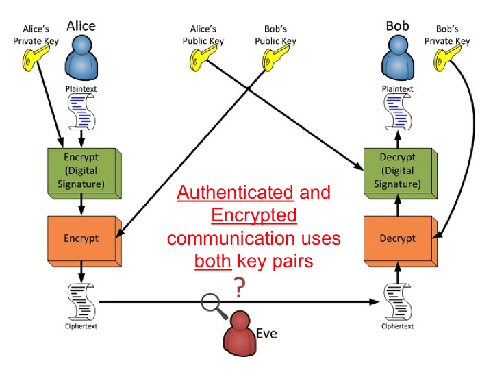

# Encryption

When Alice wants to send Bob a private message, there are two security principles in play:
* Confidentiality: Only Alice and Bob should be able to know the contents of the message
* Integrity: Bob should be able to verify if the message was sent by Alice and was not modified

To satisfy these requirements, we can use public-private key encryption and signing.

* Alice creates a message
* She signs the message with her private key. (Integrity)
  * Since only she has her private key, only she can sign the message with that private key. (Integrity)
  * The signature is a product of both her private key and the message itself.
  * The signature for that message will be different than a signature of another message.
* She then encrypts the signed message with Bob's public key (Confidentiality)
  * Since Bob's public key is public, anyone can encrypt any message for Bob using his public key
* Alice sends the message to Bob
  * Anyone can intercept this message, but no one but Bob is able to read it. The encrypted message is unreadable
  * Even Alice cannot decrypt the message. (Confidentiality)
* Bob receives the message and is able to decrypt it using his private key. (Confidentiality)
* Using Alice's Public key, he is able to verify the signature of the message. (Integrity)
  * Validation will check if the signature is created by Alice.
  * Anyone can send Bob a signed and encrypted message, but the signature will prove the message is from Alice or not, since only Alice can create a signature that correctly verifies with Alice's Public key.

# Sources:
* [Asymmetric Encryption](https://www.usna.edu/CyberDept/sy110/lec/cryptAsymmEnc/lec.html)
* [Public-private key cryptography](https://en.m.wikipedia.org/wiki/Public-key_cryptography) on Wikipedia
* [Digital Signatures](https://en.m.wikipedia.org/wiki/Digital_signature) on Wikipedia
* [Bad Cryptography](https://its.ny.gov/sites/default/files/documents/2bruce_barnett.pptx.pdf) by Bruce Barnett