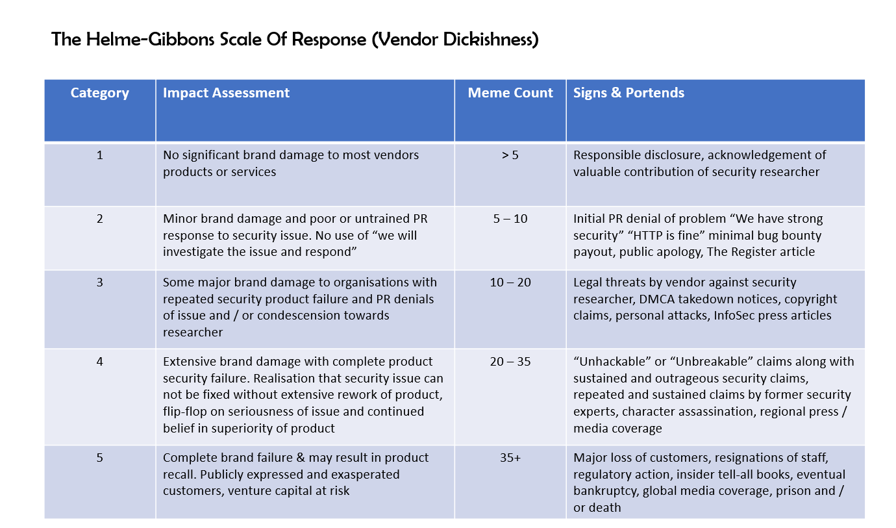

# Handling responsible disclosure

Having a responsible disclosure procedure in place is a positive sign that you "take security seriously". It tells white-hat hackers that when they find a vulnerability in your software, service or product, they can be confident that you handle it with care and not seek out legal action against the reporter. 

[Guise Bule](https://twitter.com/secjuice) has an excellent [post](https://www.secjuice.com/dealing-with-vulnerability-disclosures/) on why this is important and what the best practices in responsible disclosure are.

## Two paths

Every software product can have a bug, some which degrade its security. A security bug in a live product can be discovered by hackers. But there are different types of hackers, which will dictate the consequences that evolve from the bug.

### White hat path
* Security researcher reports an incident responsibly through:
  * Responsible disclosure process
  * Bug bounty program
* Incident Management can start controlled mitigation in cooperation with researcher
* Fix can be made in quality-controlled process
  * Estimate on fix-date can be discussed along with possible delay (and reasons) to prevent early disclosure
* PR can coordinate full disclosure with researcher for joint and / or coordinated statement
* Full disclosure can be made after fix has been deployed
  * Adds to transparency and trust

### Black hat path
* Security researcher finds vulnerability, his options are:
  * Dump data breach
  * Use vulnerability for criminal gain
  * Sells on vulnerability market
* Damage as a result
* Panic mode initiated for:
  * Legal tries to contain damage with legal actions (if possible)
  * PR starts to panic-spin breach and / or damage
    * PR-Nightmare ensues
  * Incident management started, while damage and disclosure is already public
    * Panic fix is released without researcher's validation and thus is not sufficient
    * 2nd fix (and possible 3rd fix?) released to stem the bleeding

### Helme-Gibson scale of response (Vendor Dickishness)

Security professionals [Mike Thompson](https://twitter.com/AppSecBloke) and [Ian Thornton-Trump](https://twitter.com/phat_hobbit) from [The Beer Farmers](https://thebeerfarmers.org/) based this scale on comments from [Scott Helme](https://twitter.com/Scott_Helme) and [Andrew Tierney](https://twitter.com/cybergibbons) (Cybergibbons). 

# Sources:

Handling responsible disclosures:
* How to [deal with a hacker](https://www.secjuice.com/dealing-with-vulnerability-disclosures/) finding holes in your security
* [Training](https://www.secjuice.com/how-to-deal-with-security-researchers-on-social-media/) for Social Media marketing team on how to respond to disclosures from security researchers

Example of excellent post-mortems:
* [Cloudflare](https://blog.cloudflare.com/quantifying-the-impact-of-cloudbleed/)
  * "I don't mind using this company, because I know when things eventually do go wrong, they're gonna nail the fix" - [Scott Helme](https://youtu.be/GPmMGKDJ4QY?t=2413) 
* [Fox-IT](https://www.fox-it.com/en/insights/blogs/blog/fox-hit-cyber-attack/)
* [Red Cross - Australia](https://www.smh.com.au/politics/federal/red-cross-data-leak-personal-data-of-550000-blood-donors-made-public-20161028-gscwms.html)
  * Specifically at 1:22 The apology
* [Disqus](https://blog.disqus.com/security-alert-user-info-breach)
* [Mozilla](https://blog.mozilla.org/blog/2019/05/09/what-we-do-when-things-go-wrong/)
* [Coinbase](https://blog.coinbase.com/responding-to-firefox-0-days-in-the-wild-d9c85a57f15b)

Example of bad response to a disclosure:
* [Atrient](https://www.secjuice.com/security-researcher-assaulted-ice-atrient/) assualts security researchers over PowerKiosk marketing Platform disclosure
  * Notice the productive and responsible attitude of FBI Cyber Fusion Unit in this story
* [Chilling effect](https://www.zdnet.com/article/chilling-effect-lawsuits-threaten-security-research-need-it-most/) of lawsuits
* [List](http://attrition.org/errata/legal_threats/) of Legal threats against security researchers
