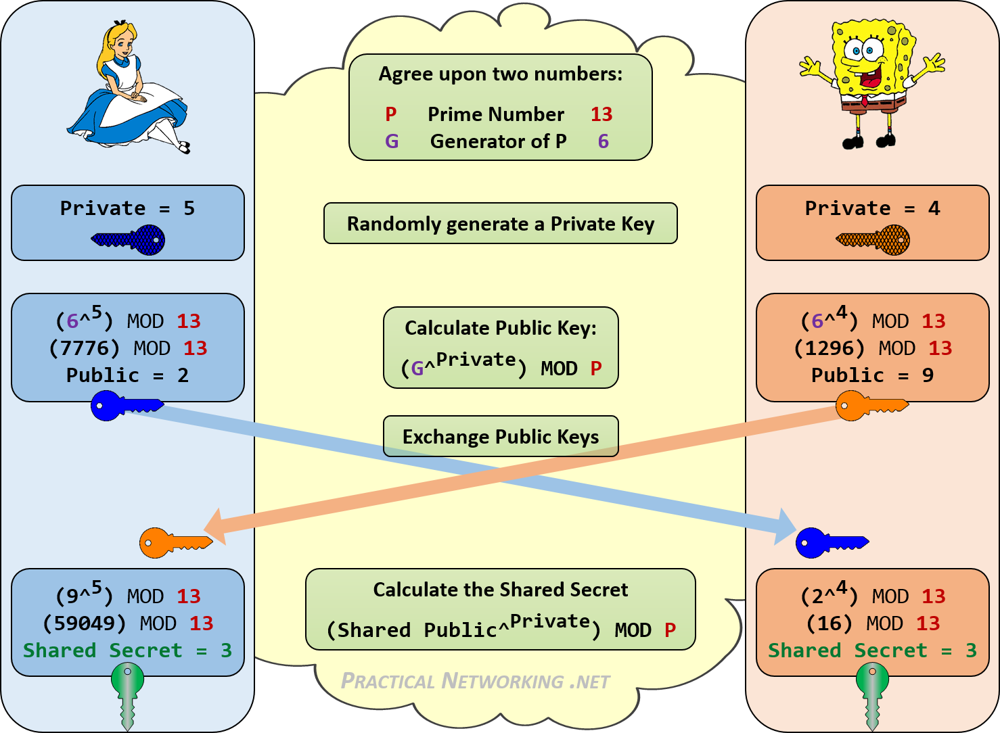

# Diffie Hellman

The Diffie Hellman key-exchange method allows for any number of individuals to securely exchange (symmetrical) cryptographic keys over a public channel.
This can be done using mathematical properties of large prime-numbers and modulo functions. Below is an example of such a key exchange with 
small primenumbers to be able to understand the basics. For sufficiently secure Diffie-Hellman key exchange, the number p in the algorithm 
should be at least 2048 bits. [source](https://en.wikipedia.org/wiki/Diffie%E2%80%93Hellman_key_exchange#Practical_attacks_on_Internet_traffic)

In onderstaande voorbeeld gebruiken Alice en Bob het Doffie Hellman algoritme voor key exchange. Als basis-getallen komen zij overeen:
* p = 13
* g = 6

* Alice kiest als persoonlijk secret a: 5
* Bob kiest als persoonlijk secret b: 4

Beide rekenen nu uit obv. (g^private) MOD p:
* Alice -> A = (6^5) MOD 13 = 2
* Bob -> B = (6^4) MOD 13 = 9

Op basis van deze publieke informatie kunnen Alice en Bob nu hun eigen secrets a en b gebruiken om een gezamenlijke shared secret overeen te komen:
* Alice -> Sa = (9^5) MOD 13 = 3
* Bob -> Sb = (2^4) MOD 13 = 3

In dit voorbeeld is de status van informatie als volgt:

| Alice     |   Public  |   Bob     |
| --------- | --------- | --------- |
| a = 5     | p = 13    | b = 4     |
|           | A = 2     |           |
| Sa = 3    | B = 9     | Sb = 3    |

In onderstaande diagram wordt verduidelijkt welke informatie voor wie beschikbaar is.

Sources:

* [Wikipedia](https://en.wikipedia.org/wiki/Diffie%E2%80%93Hellman_key_exchange)
* [Youtube](https://youtu.be/YEBfamv-_do)
* [Diffie-Hellman exploiting](https://blog.trendmicro.com/trendlabs-security-intelligence/how-exploit-kit-operators-are-misusing-diffie-hellman-key-exchange/)