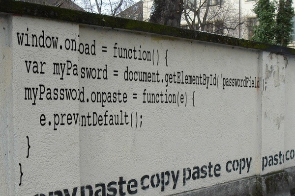
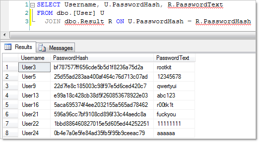
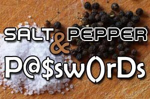

Original publishing at [First8](https://technology.first8.nl/wachtwoorden-3-mythes-4-fouten-en-5-tips-voor-ontwikkelaars-deel-1/)


# Wachtwoorden: 3 mythes, 4 fouten en 5 tips voor ontwikkelaars (deel 1)

Als ontwikkelaars hebben we tegenwoordig een grote verantwoordelijkheid. We moeten ervoor zorgen dat onze gebruikers zich
zo veilig en betrouwbaar mogelijk kunnen identificeren. In [deel één](../2018-02-08_passwords_myths_errors_tip_for_users/README.md) 
van deze blog vertelde ik over de mythes, fouten en tips voor gebruikers. In dit deel zal ik toelichten waar wij als ontwikkelaars 
vaak de fout in gaan. In deel 3 zal ik de tips gericht op ontwikkelaars beschrijven.


Als Senior Java Developer bij First8 houd ik me tijdens en buiten werktijden bezig met security en privacy. Door kennis hierover 
voor mezelf en mijn vakgenoten te vergroten, hoop ik de wereld veiliger te maken.

Ook in dit deel zal ik een aantal mythes ontkrachten. Daarna licht ik een aantal fouten toe die we als ontwikkelaar nog steeds maken.

# Mythes

## Periodiek veranderen

Laten we meteen beginnen met de meest hardnekkige mythe. Periodiek veranderen van wachtwoorden helpt niet. Als je je gebruikers 
gaat dwingen om periodiek een nieuw wachtwoord te kiezen, dan gaan ze simpelweg een reeks gebruiken. Het is dus veel beter 
om goed te monitoren op potentiële wachtwoord-lekken en evt. ongeautoriseerde toegang. In die gevallen is er tenminste een 
goede reden voor een wachtwoord-reset.


```
1. MyComplexPW1!
2. MyComplexPW2!
3. MyComplexPW3!
```

## Complexiteit

Je kent de standaard regeltjes wel: minimaal één hoofdletter, één kleine letter, één cijfer en één leesteken. Maar dan niet 
die, die en die. Met de meest recente Unicode karakter-set kunnen gebruikers helemaal los gaan met emoji’s, Aziatische, 
Arabische en andere non-Latin karaktersets en allerhande rare figuurtjes. Zoals [hier](https://app.pluralsight.com/player?name=hack-yourself-first-m10&mode=live&clip=2&course=hack-yourself-first&author=troy-hunt) (4:40) 
al wordt uitgelegd, een XSS attack-string is een vrij goed wachtwoord, maar wordt vaak niet toegestaan. De bedoeling van 
al die regels is nobel: we willen onze gebruikers zoveel mogelijk stimuleren om een goed en veilig wachtwoord te gebruiken. 
Maar wat bereiken we ermee?

Kijk eens naar onderstaande lijst. Dit zijn allerhande varianten van het woord ‘password’ en het aantal keren dat deze werd 
uitgeprobeerd in een brute-force hack. In totaal werden 49 verschillende varianten geprobeerd.

```
 17 p455w0rd
 18 p4ssword
 19 p@55w0rd
 27 P@ssw0rd
 29 p@ssword
 32 p4ssw0rd
 88 pa55w0rd
115 passw0rd
125 p@ssw0rd
294 password
Total: 1070
```


We weten dat gebruikers al snel terugvallen op varianten ([l33tsp34k](https://en.wikipedia.org/wiki/Leet)) van bestaande woorden. 
Uit ervaring weten we ook, dat crackers deze varianten kennen en dit eenvoudig in hun aanvallen en password-dictionaries opnemen. 
Moeilijke regels wekken dus schijnveiligheid. Daarnaast zorgt de complexiteit ook voor een uitdaging bij gebruikers. Zij 
worden beperkt in de keuze van hun wachtwoord. Zijn bepaalde speciale tekens wel of niet toegestaan? Zijn er nog hoofdletter 
/ kleine letter eisen? Additionele eisen? Bij de Nederlandse Belastingdienst voor MKB is de eisenlijst al behoorlijk lang en 
onnodig complex. Bovendien leggen ze beperkingen op, die een gebruiker dwingen om minder sterke wachtwoorden te kiezen. Er is 
slechts een kleine subset aan speciale karakters mogelijk. De overige eisen zijn eveneens complex en beperkend. Op de eerste 
regel die je in het plaatje ziet, kom ik later nog terug.


## Copy-paste

Sommige websites blokkeren copy-paste acties in het wachtwoord-veld: Stop Password Pasting of SPP. Er zijn een aantal 
overtuigend klinkende redenen die dit rechtvaardigen. Er is geen enkele reden die dit rechtvaardigt.



### Brute-force attacks

Password Pasting zou het mogelijk maken om een geautomatiseerd programma brute-force aanvallen te laten uitvoeren. Door SPP 
zou deze vorm worden geblokt. De realiteit is, dat brute-force ook zonder het html-form kunnen worden uitgevoerd. Tools als 
Burp Suite kunnen requests eenvoudig herhalen met andere parameters. SPP stopt dit niet. Bovendien zijn er veel betere 
manieren om brute-force aanvallen te blokkeren. Denk hierbij aan korte vertragingen na elke inlog-poging en (tijdelijke) 
lock-outs na een aantal foutieve pogingen.

### Slecht onthouden

Door SPP zou een gebruiker vaker het wachtwoord zelf invoeren en daarmee sneller het wachtwoord kunnen onthouden. Bij 
veelgebruikte websites, waar gebruikers dagelijks op inloggen zou dit misschien nog werken. De meest gevoelige sites, 
zoals belastingdienst, pensioen, hypotheek, verzekeringswebsites en mogelijk internetbankieren worden echter sporadisch 
bezocht. Daarnaast wil je de gebruiker zoveel mogelijk complexe, lange en unieke wachtwoorden laten kiezen. Het is 
onrealistisch om van gebruikers te verlangen dat ze deze unieke wachtwoorden allemaal gaan onthouden. Als strategie is 
dit dus niet haalbaar.

### Clipboard

Wachtwoorden zouden onveilig lang op het clipboard van de gebruiker blijven staan. Als een gebruiker zelf een wachtwoord 
uit een document copy-paste, dan blijft deze inderdaad op het clipboard staan, totdat het wordt overschreven. De meeste 
wachtwoord-managers verwijderen echter het wachtwoord, zodra deze is ge-paste. Hiermee wordt de tijd en het risico verkort.
Sommige password-managers gebruiken bovendien virtuele keyboards om het copy-paste risico te ontwijken. Bovendien is de 
machine van een gebruiker met een clipboard-capturing virus of malware al per definitie onbetrouwbaar. Clipboard capturing 
is dan één van de vele aanvallen die het virus kan proberen en zeker niet het grootst mogelijke probleem.

### SPP maakt onveilig

Het blokken van copy-paste helpt dus niet of nauwelijks om systemen veiliger te maken. Het maakt wachtwoorden juist 
onveiliger. Password-pasting geeft de gebruiker namelijk belangrijke mogelijkheden. De gebruiker kan eenvoudiger unieke 
wachtwoorden gebruiken met behulp van een wachtwoord-manager. Deze hebben meestal copy-paste mogelijkheden nodig om te 
kunnen werken. Copy-paste verlaagt daarnaast de tijd die een gebruiker nodig heeft om in te loggen en voorkomt type-fouten 
bij complexe en lange wachtwoorden.

# Fouten

Tot zover deze mythen die onbewust en vaak onbedoeld tot fouten leiden. De volgende punten zijn echter bekende en nog 
steeds niet goed gehanteerde regels.

## Maximale lengte


We zagen dit al in het voorbeeld van de belastingdienst. Hierbij werd het wachtwoord beperkt tot maximaal 25 karakters. 
Een goedwillende gebruiker die een extra lang wachtwoord wil instellen, wordt hiermee beperkt. Een langer wachtwoord is 
niet eens onredelijk, alhoewel slechts zeer weinig gebruikers boven 100 a 200 karakters gebruiken. Mocht je dan ook een 
maximum willen instellen, neem dan een veel ruimer getal. NIST adviseert minimaal 64 karakters toe te staan. Kosten van 
opslag zijn dusdanig laag, dat dit geen limiterende factor meer is. We zullen later zien dat beperkingen in lengte niet 
of nauwelijks nodig zijn, zelfs als je de marginale kosten voor opslag zou mee rekenen.

## Mailen van wachtwoord

Bij het aanmaken van een account of de wachtwoord-vergeten functie wordt soms nog het wachtwoord in plain-text naar de 
gebruiker gemaild. Dit is om meerdere redenen een slecht idee. Ten eerste is e-mail per definitie onveilig, tenzij je 
PGP gebruikt. Ten tweede geef je met een plain-text wachtwoord in de mail via de wachtwoord-vergeten functie een cruciale 
fout toe: je kunt het wachtwoord leesbaar herproduceren. Dit kan duiden op het gebruik van een slecht algoritme, 
bijvoorbeeld door gebruik van encoding (bv. base64) of encryptie terwijl goede hashing gebruikt zou moeten worden. Het 
kan echter nog slechter:

## Plain-text

Geloof het of niet: er worden nog steeds wachtwoorden opgeslagen in plain-text. Dat plain-text storage fout is, mag duidelijk 
zijn. Het is echter lastig en complex om de opslag van wachtwoorden echt goed te doen. Encoding, encryptie, hashing, als je 
deze termen niet vlekkeloos en in detail kunt toelichten, dan zul je er gegarandeerd fouten mee maken.



### Encoding

Bijna net zo makkelijk leesbaar als plain-text is encoding. Er zijn meerdere gevallen bekend waarbij de wachtwoorden in 
Base64 encoding zijn opgeslagen. Deze en andere encoding kan eenvoudig worden omgekeerd. Een eigen programma maken om dit 
offline uit te voeren kost weinig moeite. Encoding werkt twee richtingen op, het is omkeerbaar. En dat is bij wachtwoorden 
niet nodig.

### Encryptie

Ook encryptie alleen is niet voldoende om wachtwoorden veilig op te slaan. Net als encoding is encryptie omkeerbaar, 
hoewel je soms het encryptie-mechanisme en mogelijk de sleutel moet weten om dit uit te kunnen voeren. Bij zwakkere encryptie 
kunnen met decryptie de originele wachtwoorden worden achterhaald.

### Hashing

De enige manier om wachtwoorden te bewerken zodat ze niet tot het originele wachtwoord te herleiden zijn, is hashing en 
wel met een sterk hashing-mechanisme. Je kunt onmogelijk een hash terugrekenen naar het originele wachtwoord. Wat een 
aanvaller wel zou kunnen doen, is een lange lijst maken met bekende wachtwoorden en van elk de hash zelf uit rekenen. 
Door deze zelfgemaakte lijst te vergelijken met de hashes uit een gestolen database, kan een aanvaller eenvoudig de oorspronkelijke 
wachtwoorden opzoeken. Soortgelijke lijsten circuleren al op internet en worden ook wel rainbow-tables genoemd.

### Salt

Een verdediging tegen rainbow-tables is het gebruik van salt. Een salt combineert het wachtwoord met een deel van de andere 
gegevens van de gebruiker om een complexere string te maken. Bij een inlog-poging kan de invoer weer worden gecombineerd 
met dezelfde gegevens (bv. de achternaam van de gebruiker) en vergeleken met de database-waarde. Als de aanvaller echter 
beschikking over de database heeft, dan heeft hij ook de beschikking over de gegevens die gebruikt worden voor het salten. 
Hij hoeft enkel te achterhalen welke gegevens als salt worden gebruikt.



### Pepper

Ook hier is weer een verdediging voor te bedenken. Een unieke en lange geheime sleutel wordt gebruikt om het wachtwoord 
opnieuw te hashen. Deze sleutel wordt vaak pepper of [HMAC](https://en.wikipedia.org/wiki/Hash-based_message_authentication_code) 
genoemd. De methode die hierbij gebruikt wordt is lastig uit te leggen en valt meer onder cryptografie. Een vereenvoudigde 
uitleg van pepper is als een salt die voor iedere gebruiker hetzelfde is, maar die wel buiten de database liefst in een 
veilige omgeving (vault) wordt opgeslagen.

### Hardening

Zelfs als je bovenstaande maatregelen correct implementeert kan een aanvaller nog altijd proberen om simpelweg alle mogelijke 
wachtwoorden te proberen: brute-force. Een verdediging tegen brute-forcing kan door ervoor te zorgen dat de encryptie bij 
een password check of “omzetting” memory en cpu intensief is. Hierdoor wordt de tijd en hardware die nodig is om de wachtwoorden 
te kraken flink verhoogd.

Door eerst te hashen met SHA2-512 wordt het wachtwoord, ongeacht de lengte omgezet in een 512 bits hash. Hierdoor kan elk 
wachtwoord van arbitraire lengte worden opgeslagen in veld van 64 karakters. Hiermee hoeven we dus geen extra opslagruimte 
te reserveren voor extra lange wachtwoorden. Door het vervolgens te combineren met een salt van 8 karakters kunnen we deze 
encrypten met [bcrypt](https://medium.com/@mpreziuso/password-hashing-pbkdf2-scrypt-bcrypt-1ef4bb9c19b3). Een klein nadeel 
van bcrypt is namelijk de limiet van 72 karakters. Andere opties naast bcrypt zijn scrypt, PBKDF2 en argon2.

## Wiel uitvinden

In veel organisaties wordt functionaliteit zelf ontwikkelt. Bestaande pakketten sluiten vaak niet precies aan op de behoefte 
van de organisatie. Ook voor identity management en authenticatie wordt dan al snel een eigen oplossing gebouwd. De complexiteit 
en gemis aan zeer specialistische kennis zorgt dan al snel voor fouten in de software. Dit artikel is nog beperkt tot enkel 
wachtwoorden. Er valt nog een hoop te schrijven over account initialisatie, privacy, rechtenbeheer, beveiliging etc. Er zijn 
ontzettend veel mogelijkheden om fouten te maken. En een enkele fout kan funest zijn. Gelukkig hoef je als ontwikkelaar niet 
alles zelf te doen. De meeste frameworks hebben uitgebreide mogelijkheden om account en identity management op te zetten. 
Koppeling met externe identity providers zoals Google of Facebook, zijn vaak ingebakken of als plugin beschikbaar. En er 
zijn vaak mogelijkheden om het account management naar wens aan te passen. Er zijn dus weinig tot geen redenen om zelf opnieuw 
het wiel uit te vinden.


# Frameworks en moderne wachtwoord policy

De regels van vroeger zijn dus achterhaald. Beperkingen in de wachtwoord-policy werken averechts. Je kunt ze dus beter 
weglaten. Daarnaast is goede en veilige opslag van wachtwoorden een complex probleem. Er is diepgaande specialistische 
kennis voor nodig om dit goed te doen. Gelukkig zijn er voldoende standaard oplossingen die hier speciaal voor ontwikkeld 
zijn. Gebruik deze dan ook. Een framework als [Spring Security](https://projects.spring.io/spring-security/) helpt je als 
ontwikkelaar om goed en veilig identity management op te zetten.

[Deel 3](../2018-05-04_passwords_myths_errors_tips_for_devs_2/README.md)